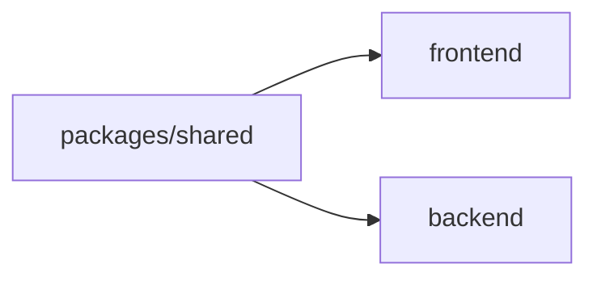

# 01 — Architecture

## Monorepo layout (target)

The repo mirrors [`Garama/`](../../Garama/) so the team has zero context-switch cost.

```
flying-tung-tung/
├── package.json              # bun workspaces + turbo scripts
├── turbo.json                # dev / build / lint / typecheck pipelines
├── tsconfig.base.json        # shared compiler options
├── .prettierrc / .prettierignore
├── eslint.config.mjs
├── .gitignore
├── README.md
├── assets/                   # source-of-truth GLBs (already exists)
│   ├── tung-tung.glb
│   └── angelic-tung-tung.glb
├── plans/                    # this directory
├── frontend/                 # Vite + Three.js (primary deliverable)
│   ├── package.json
│   ├── tsconfig.json
│   ├── vite.config.ts
│   ├── index.html
│   ├── public/
│   │   ├── models/           # copies of /assets + city props
│   │   └── textures/
│   └── src/
│       ├── main.ts
│       ├── game/             # loop, state, systems
│       ├── scene/            # renderer, camera, lights, sky, fog
│       ├── entities/         # plane, projectile, building
│       ├── world/             # procedural city + prop loader
│       ├── input/            # mouse + keyboard
│       ├── ui/               # HUD overlays
│       └── utils/
├── backend/                  # Bun + Hono + Socket.IO (stub only)
│   ├── package.json
│   ├── tsconfig.json
│   └── src/
│       ├── index.ts
│       └── server.ts
└── packages/
    └── shared/
        ├── package.json
        ├── tsconfig.json
        └── src/
            ├── index.ts
            ├── config.ts     # tunables (speed, turbo mult, etc.)
            ├── types.ts      # PlayerState, Projectile, Vec3
            └── events.ts     # future net event names
```

## Tech choices

| Layer | Choice | Why |
|-------|--------|-----|
| Package manager | **bun** workspaces | Matches Garama; fast installs. |
| Task runner | **Turborepo** | Matches Garama; cached `dev`/`build`/`lint`/`typecheck`. |
| Frontend bundler | **Vite** | Instant HMR, ESM-native, ideal for a pure game (no SSR needed). |
| Render | **Three.js** (imperative) | Owner preference; smallest, fastest, full control of the loop. |
| Language | **TypeScript** everywhere | Safety + shared types via `@flying-tung-tung/shared`. |
| Backend (stub) | **Bun + Hono + Socket.IO** | Mirrors Garama; ready for later PvP without re-scaffolding. |
| Lint/format | **ESLint flat + Prettier** | Mirrors Garama configs. |

## Workspace dependency graph



`frontend` and `backend` both depend on `@flying-tung-tung/shared` via `workspace:*`. They never depend on each other directly; the wire protocol is the only contract between them, defined in `shared/src/events.ts`.

## Turbo pipelines

Reused verbatim from Garama's `turbo.json` (see [`Garama/turbo.json`](../../Garama/turbo.json)):

- `dev` — non-cached, persistent (runs Vite dev server + Bun watch).
- `build` — caches `dist/**`.
- `lint`, `lint:fix`, `typecheck`, `test`, `format`, `format:check`.

Root scripts:

```jsonc
{
  "dev":        "turbo dev",
  "dev:frontend": "cd frontend && bun run dev",
  "dev:backend":  "cd backend && bun run dev",
  "build":      "turbo build",
  "lint":       "turbo lint",
  "typecheck":  "turbo typecheck",
  "format":     "prettier --write ."
}
```

## Why Vite + plain Three.js (not R3F)

- The owner explicitly chose imperative Three.js.
- A single `gameLoop.ts` driving deterministic updates makes future server reconciliation trivial.
- No reconciler overhead → lower frametime budget pressure.
- Aligns with Garama's existing `frontend/src/game/*.ts` style (renderer.ts, gameLoop.ts, camera.ts, input.ts) — we can borrow patterns directly.

## Borrowing from Garama

We will *not* copy code wholesale, but the following modules from [`Garama/frontend/src/game/`](../../Garama/frontend/src/game/) are good shape references:

- `renderer.ts` — WebGLRenderer setup, resize handling.
- `gameLoop.ts` — fixed timestep accumulator.
- `camera.ts` — chase camera math.
- `input.ts` — keyboard/mouse abstraction.
- `gameState.ts` — single source-of-truth state object.

## Future-proofing for PvP

To make multiplayer additive rather than a rewrite:

1. All gameplay-mutating logic lives in `frontend/src/game/systems/*` and reads/writes one `GameState` object.
2. Inputs are converted to a `PlayerInput` struct (defined in `shared/`) before being applied — same struct will later be sent to the server.
3. Remote players will be a list of `RemotePlayer` rendered via the same plane entity code path; only the input source differs (network instead of local).
4. `packages/shared/events.ts` already declares the future event names so both sides type-check today.
