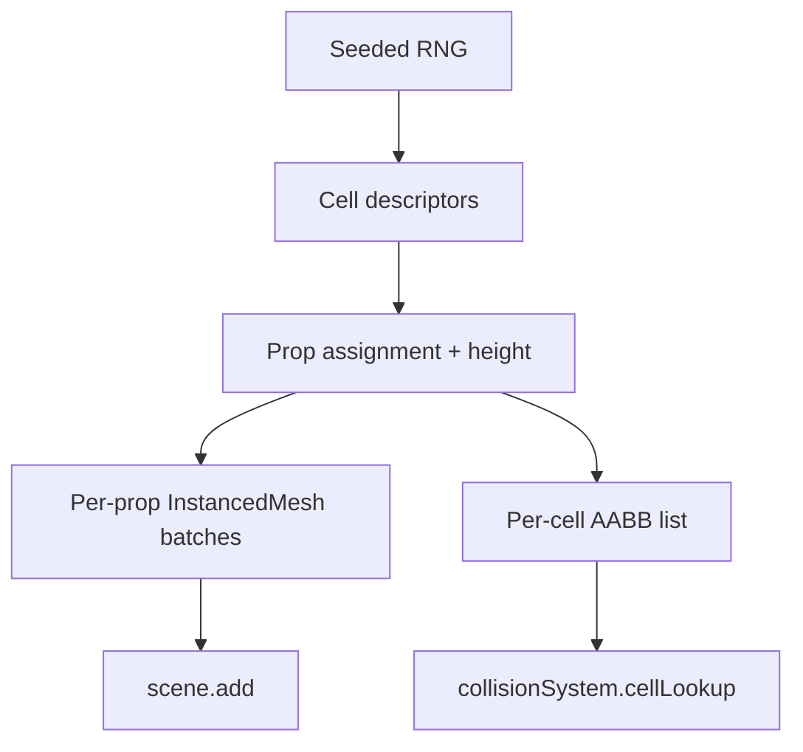

# 05 — City Map (Hybrid Procedural + GLB Props)

## Approach

Generate a deterministic city grid in code, then **populate** each cell with one or more pre-made GLB building props from a free pack. Roads are drawn on the ground texture, not modeled. This gets us a dense, varied city for ~zero authoring cost.

## Layout parameters (`shared/src/config.ts`)

```ts
export const CITY = {
  SEED:           1337,
  GRID_SIZE:      40,         // 40x40 cells
  CELL_SIZE:      30,         // world units per cell
  ROAD_WIDTH:     6,          // visual road border per cell
  MAX_BLDG_PER_CELL: 1,       // MVP: one building per cell
  HEIGHT_MIN:     8,
  HEIGHT_MAX:     45,
  EMPTY_CHANCE:   0.12,       // some cells stay empty (parks/plazas)
  PARK_CHANCE:    0.05,
};
```

World extent = `40 * 30 = 1200` units per side. Plane's `WORLD_HALF_SIZE = 1500` gives a small flying margin around the city.

## Generation algorithm

```text
seedRng = mulberry32(SEED)
for x in 0..GRID_SIZE:
  for z in 0..GRID_SIZE:
    cell = newCell(x, z)
    r = seedRng()
    if r < EMPTY_CHANCE:        cell.kind = 'empty'
    elif r < EMPTY_CHANCE+PARK_CHANCE: cell.kind = 'park'
    else:
      cell.kind   = 'building'
      cell.propId = pickProp(seedRng)        # weighted by prop "tier"
      cell.height = lerp(HEIGHT_MIN, HEIGHT_MAX, seedRng())
      cell.rotation = floor(seedRng() * 4) * (PI/2)   # 4 cardinal rotations
emit:
  - per-prop transform list (scale Y to target height)
  - per-cell AABB array  (used by collisionSystem)
```

Determinism is important: the same seed always produces the same city, which makes future server reconciliation trivial.

## Rendering buildings via instancing

One `THREE.InstancedMesh` per **prop type** (a "prop" = one mesh extracted from the GLB pack). Each instance gets:

- `Matrix4` = `T(cellCenter) * R(yaw90) * S(1, heightScale, 1)`.
- Optional per-instance color tint via `InstancedMesh.setColorAt` for visual variety.

Why instancing: 40×40 = 1600 cells × ~1 prop each ≈ 1600 building draws → batched into ~5–10 draw calls (one per prop type). Easily 60 FPS on integrated GPUs.

## Roads + ground

- A single large `THREE.PlaneGeometry(WORLD * 1.2, WORLD * 1.2)` lying on `y = 0`.
- Texture = a tiled "road grid" repeated `GRID_SIZE` times so each cell shows a square of pavement bordered by road. We'll use a simple procedurally-drawn canvas texture (no asset needed) — see [`06_ASSETS.md`](06_ASSETS.md).
- A second, larger ground plane underneath in a flat green for "outside the city" terrain.

## Sky + fog

- `THREE.Sky` (from `three/examples/jsm/objects/Sky.js`) with sun direction matching the directional light.
- `scene.fog = new THREE.FogExp2(skyColor, 0.0008)` — hides the city's far edge naturally.

## Park & empty cells

- **Empty:** nothing rendered; pure pavement.
- **Park:** small instanced "tree" prop at the cell center (also from Kenney pack), with several rotated copies if budget allows.

## Collision data

`city.generate()` returns:

```ts
interface CityResult {
  buildings: { box: Box3; cellX: number; cellZ: number; }[];
  cellLookup: Map<string, number[]>;   // "x,z" -> indices into buildings
  groundY: 0;
}
```

`collisionSystem` queries `cellLookup` for the projectile's current cell and tests only those AABBs.

## Diagram



## Performance notes

- Disable shadows on building instances (or use a single big shadow-casting sun on the ground plane only).
- `meshInstance.frustumCulled = true`; we still benefit because each prop type's instances live in one mesh with a combined bounding sphere covering the whole grid (mostly always visible — that's fine, draw cost is not the issue, vertex count is, and instancing solves that).
- Use `THREE.MeshLambertMaterial` (cheap) for buildings; reserve `MeshStandardMaterial` for the player plane.

## Out of scope (later)

- LOD for skyscrapers.
- Streaming chunks for an "infinite" city.
- Dynamic time-of-day.
- NPC traffic.
