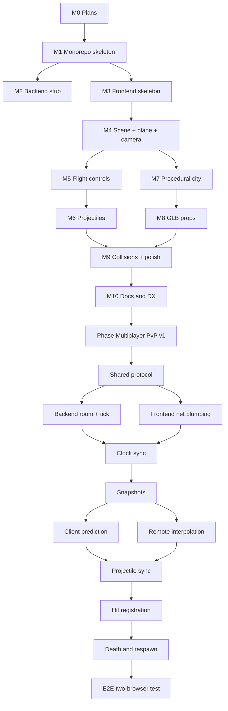

# 08 — Roadmap

A linear, dependency-ordered build plan. Each item is a milestone that produces something runnable. No time estimates — just order.

## Status legend

`[x]` done · `[~]` partial / works with placeholder · `[ ]` not started

## Milestone 0 — Plans (this document)

- [x] Capture decisions: stack, controls, map, monorepo shape.
- [x] Author the plan files in `plans/`.
- [x] Owner approved the plan.

## Milestone 1 — Monorepo skeleton ✅

- [x] Root `package.json` with bun workspaces (`backend`, `frontend`, `packages/*`).
- [x] Root `turbo.json` mirroring Garama.
- [x] Root `tsconfig.base.json`, `.prettierrc`, `.prettierignore`, `eslint.config.mjs`, `.gitignore`.
- [x] `packages/shared` package with `package.json`, `tsconfig.json`, and `src/index.ts` re-exporting `config.ts`, `types.ts`, `events.ts`.
- [x] `bun install` succeeds at the root (540 packages).
- [x] `turbo typecheck` passes across all 3 workspaces.

## Milestone 2 — Backend stub ✅

- [x] `backend/package.json` with hono + socket.io deps.
- [x] `backend/src/server.ts` exporting `createServer()` with `/health` only.
- [x] `backend/src/index.ts` boot file.
- [x] `bun run dev:backend` starts and `GET /health` returns `{ ok: true, service: 'flying-tung-tung-backend', uptimeSec: ... }` (verified live).

## Milestone 3 — Frontend skeleton ✅

- [x] `frontend/package.json` (Vite + TS + three + shared workspace dep).
- [x] `frontend/vite.config.ts`, `frontend/index.html`, `frontend/src/main.ts`.
- [x] Folder layout per [`02_FRONTEND_STRUCTURE.md`](02_FRONTEND_STRUCTURE.md).
- [x] Canvas + resize handler renders (verified via `vite build` in 2.23s).
- [x] `bun run dev` (root) starts both apps via Turborepo.

## Milestone 4 — Scene + plane + chase camera ✅

- [x] Sky (`three/examples/jsm/objects/Sky.js`) + sun (DirectionalLight) + ambient + hemi + fog matched to horizon.
- [x] Ground plane with procedural canvas-drawn road texture + outer green terrain.
- [x] GLB loader; load `tung-tung.glb`; normalize scale + derive nose offset.
- [x] Chase camera following the plane with smoothing.
- [x] HUD overlay HTML/CSS shell (crosshair, speed, turbo gauges, loading screen).

## Milestone 5 — Flight controls ✅

- [x] `input/mouse.ts` populates `state.input.cursorNdc` + `shootPressed` + `turbo`.
- [x] `planeController` system implements cursor-follow math with dead zone, rate damping, integration.
- [x] Roll / banking visual driven by yaw rate.
- [x] Right-click held → turbo (with FOV pump from 70 → 84).
- [x] World floor/ceiling clamp + soft horizontal bounds with auto-yaw-home.
- [x] Window-blur safety (zero inputs + release turbo).
- [x] Context menu suppressed so right-click works as turbo.

## Milestone 6 — Projectiles ✅

- [x] `entities/projectile.ts` with `InstancedMesh` of `POOL_SIZE = 256`.
- [x] Fire on left-click with `COOLDOWN_SEC` (edge-triggered).
- [x] Lifetime expiry + despawn (matrix scaled to 0).
- [x] Spawn from nose anchor with plane forward velocity * `PROJECTILE.SPEED`.
- [x] Cheap ground despawn (`y <= 0`).

## Milestone 7 — Procedural city ✅

- [x] Seeded RNG (`utils/rng.ts` Mulberry32) — deterministic from `CITY.SEED`.
- [x] City grid generator (40×40) emits cell descriptors (empty / park / building) + height + rotation.
- [x] Canvas-generated road/ground texture, tiled per cell.
- [x] Skybox via `three/examples/jsm/objects/Sky.js` with sun-direction sync.
- [x] Per-cell AABB lookup map for collision queries.

## Milestone 8 — GLB props integration ⚠️ partial

- [~] Source + commit Kenney City Kit + Nature Kit GLBs — **NOT YET**: drop GLBs into [`frontend/public/models/city/`](../frontend/public/models/city/) and [`frontend/public/models/nature/`](../frontend/public/models/nature/) as `building_a.glb`, `building_b.glb`, `building_c.glb`, `tree.glb`.
- [x] `propLibrary.preload()` loads all GLBs once with **automatic fallback to procedural cubes** when files are missing — the city renders today regardless.
- [x] City generator places props via `InstancedMesh` per prop type (one draw call per prop).
- [x] `CREDITS.md` under [`frontend/public/models/`](../frontend/public/models/CREDITS.md).

## Milestone 9 — Collisions + feel polish ⚠️ partial

- [x] Per-cell AABB lookup; projectile-vs-building hit test in `collisionSystem`.
- [ ] Cosmetic hit puff (TODO: tiny expanding sphere on impact).
- [x] HUD: speed readout + turbo indicator (DOM, throttled to 10 Hz).
- [ ] FPS counter (optional dev overlay).
- [ ] SFX hooks (pew on shoot, turbo whoosh).

## Milestone 10 — Docs & DX ✅

- [x] Top-level [`README.md`](../README.md) (run instructions, controls, credits, structure).
- [x] `turbo typecheck` passes across all packages.
- [x] `turbo build` succeeds (frontend Vite build OK).
- [ ] `turbo lint` not yet exercised end-to-end on the new code.
- [ ] Tag this state as "MVP" in git (owner action).

## Phase: Multiplayer (PvP v1)

Detailed design lives in [`plans/networking/`](networking/00_OVERVIEW.md). This roadmap section tracks execution. Dependency: requires Milestones 5–6 (flight + projectiles), which are done. Order matches the document numbering of the networking folder.

Numerical targets (from [`plans/networking/00_OVERVIEW.md`](networking/00_OVERVIEW.md)):
30 Hz server tick, 20 Hz snapshot, 60 Hz client render, 100 ms interp delay, 5 initial clock-sync samples, 16 max players, 1 global room.

### Shared protocol package

- [x] Add `NET` config block to [`packages/shared/src/config.ts`](../packages/shared/src/config.ts) (tick rate, snapshot rate, interp delay, etc.).
- [x] Replace [`packages/shared/src/events.ts`](../packages/shared/src/events.ts) with v1 event names + payload shapes per [`networking/01_PROTOCOL.md`](networking/01_PROTOCOL.md).
- [x] Add `PROTOCOL_VERSION = 1` constant.
- [x] Extract pure simulation math into `packages/shared/src/sim/` (`applyPlaneInput.ts`, `integrateProjectile.ts`, `quat.ts`).
- [~] [`planeController.ts`](../frontend/src/game/systems/planeController.ts) now also exports pre-saturated `state.netInputAxes` for upload; the local controller still uses three.js scratch buffers (server uses the shared math).
- [x] `turbo typecheck` passes across all three workspaces.

### Backend room + tick loop

Per [`networking/09_BACKEND_STRUCTURE.md`](networking/09_BACKEND_STRUCTURE.md).

- [x] `backend/src/utils/clock.ts` — monotonic `getServerTimeMs()`.
- [x] `backend/src/utils/ids.ts` — projectile id generator.
- [x] `backend/src/sim/player.ts` — `ServerPlayer` interface + factory.
- [x] `backend/src/sim/projectile.ts` — `ServerProjectile` interface + factory + `tryCreateProjectile()`.
- [x] `backend/src/sim/spawn.ts` — 8-point spawn picker (max-min-distance heuristic).
- [x] `backend/src/sim/hitDetection.ts` — `detectProjectileVsPlayerHits` + `resolveDeathsAndRespawns`.
- [x] `backend/src/sim/room.ts` — `Room` class (players map, projectiles map, tick + snapshot accumulator, spawn picker, events buffer).
- [x] Wire `Room#start()` from [`backend/src/index.ts`](../backend/src/index.ts).
- [~] 30 Hz tick observed cleanly across 50 snapshots in 2.5 s in headless smoke test (`backend/test-client.ts`); long-term drift not yet logged.

### Backend socket handlers

Per [`networking/07_ROOMS_AND_LIFECYCLE.md`](networking/07_ROOMS_AND_LIFECYCLE.md).

- [x] `backend/src/net/socketHandlers.ts` — `registerSocketHandlers(io, room)`.
- [x] `hello` handler: version check, capacity check, spawn pick, emit `welcome`, broadcast `playerJoined`.
- [x] `ping` handler: echo `serverTimeMs` + `serverTick`.
- [x] `input` handler: validate (shape + clamp axes), append to `player.inputQueue`, update `lastHeardAt`.
- [x] `disconnect` handler: cleanup, broadcast `playerLeft` (do not despawn projectiles).
- [x] 5 s "must hello" deadline timer.
- [x] Heartbeat-timeout kick after 15 s of no input.

### Clock synchronization

Per [`networking/02_CLOCK_SYNC.md`](networking/02_CLOCK_SYNC.md).

- [x] `frontend/src/net/clock.ts` — Garama port with `K=5`, `pauseMs=200`, `EMA α=0.12`, drift/RTT-spike resync.
- [x] `serverTimeNow(net)` helper.
- [ ] DebugInfo HUD shows RTT, clock-offset, interp-delay (Garama's mirror — deferred, easy follow-up).
- [~] Headless smoke test sees pong RTT < 5 ms on LAN; long-running drift verification deferred.

### Snapshots & frontend net plumbing

Per [`networking/08_FRONTEND_INTEGRATION.md`](networking/08_FRONTEND_INTEGRATION.md).

- [x] `frontend/src/net/socket.ts` — typed wrapper over `socket.io-client`.
- [x] `frontend/src/net/netState.ts` — `NetState` shape + `createNetState()`.
- [x] `frontend/src/net/netSystem.ts` — `startNetSystem`, `netUpdate`, `netRender`.
- [x] `socket.io-client` dependency added to [`frontend/package.json`](../frontend/package.json).
- [x] [`frontend/src/main.ts`](../frontend/src/main.ts) prompts for player name and starts net before `startGameLoop`.
- [~] `state.citySeed` is propagated from `welcome.citySeed` but `buildCity` still reads `CITY.SEED` — server uses the same constant so all clients agree; per-room seeds is filed for v2.
- [x] Add `state.remotePlayers` and `state.remoteProjectiles` to [`frontend/src/game/gameState.ts`](../frontend/src/game/gameState.ts).
- [x] `ensureRemotePlane` / `dispose` factory + cleanup in [`remotePlanesSystem.ts`](../frontend/src/game/systems/remotePlanesSystem.ts).

### Client-side prediction & reconciliation

Per [`networking/04_CLIENT_PREDICTION.md`](networking/04_CLIENT_PREDICTION.md).

- [x] `frontend/src/net/prediction.ts` — input ring buffer (size 128), `nextSeq` counter, `pushAndSendInput`.
- [x] `reconcile(snapshot, state, net)` with soft (0.25 m) / hard (5 m) thresholds.
- [x] Smooth-correct via lerp/slerp at `SMOOTH_RATE = 0.20` per snapshot.
- [ ] **Deferred**: replay unacked inputs after a hard snap. v1 keeps the snap-and-resume model so the local controller's own per-tick math stays unchanged. Acceptable on LAN where hard-snaps are exceptional.
- [ ] Two-browser jitter test pending manual run.

### Remote interpolation

Per [`networking/05_INTERPOLATION.md`](networking/05_INTERPOLATION.md).

- [x] `frontend/src/net/interpolation.ts` — per-id snapshot ring buffers (max 60 samples).
- [x] `ingestSnapshot(snap, net, state)` — push samples + latch stepwise scalars.
- [x] `interpolateRemotes(state, net)` — find bracketing snapshots, lerp pos+vel, slerp quat.
- [x] Extrapolation cap of 150 ms past the last sample.
- [x] `applyRawPose` + `renderRemotePlanes` drive `THREE.Group` transforms from interpolated state.
- [ ] Two-browser smoke test pending manual run.

### Projectile sync

- [x] Server is sole authority for projectile spawn/despawn (cooldown + nose offset = 3.5 m).
- [x] In net mode `shootPressed` → next `input.fire` (consumed in [`netUpdate`](../frontend/src/net/netSystem.ts)). Local-pool spawn path is bypassed when `state.isNetworked`.
- [x] Render projectiles from `state.remoteProjectiles` via [`renderRemoteProjectiles`](../frontend/src/game/systems/projectileSystem.ts) into the existing InstancedMesh pool.
- [x] Burst FX from `events.despawns` in [`netEventsSystem.ts`](../frontend/src/game/systems/netEventsSystem.ts).
- [~] In v1 the offline `collisionSystem` is **only** wired in single-player mode; in net mode the server has no city geometry yet, so a client's bullet may visibly pass through a far-side wall.

### Hit registration

Per [`networking/06_HIT_REGISTRATION.md`](networking/06_HIT_REGISTRATION.md).

- [x] Server-current-time sphere-vs-sphere check in `hitDetection.ts`.
- [x] Hit radius `2.5 + 0.7 = 3.2 m`; damage = 1 life per hit.
- [x] Skip self-hits and immune targets.
- [x] Emit `events.hits` per hit.
- [ ] LAN shoot-the-stationary-opponent regression — pending manual two-browser run.

### Death & respawn networking

- [x] Server flips `alive=false` on `lives=0`, schedules `pendingRespawnAt = now + DEATH.RESPAWN_DELAY_SEC`.
- [x] Client's [`deathSystem.ts`](../frontend/src/game/systems/deathSystem.ts) reads `state.player.dead` from the snapshot reconciliation; modal still appears after `DEATH.RESPAWN_DELAY_SEC`.
- [~] Respawn modal "Respawn" button is no-op in net mode — `applyServerRespawn` snaps pose when the `events.respawns` for self lands. The button is still visible.
- [x] Server picks max-min-distance from a fixed list of 8 ring spawn points.
- [ ] Pending manual two-browser verification of A-kills-B → B respawns at fresh point.

### End-to-end test (manual smoke)

Headless verification done via [`backend/test-client.ts`](../backend/test-client.ts) and [`backend/test-duel.ts`](../backend/test-duel.ts):

- [x] One-client connect → hello → welcome → snapshot stream (50 snapshots in 2.5 s = 20 Hz exact).
- [x] Two-client mutual fire — both join, simulate, fire, disconnect cleanly.
- [x] `/health` endpoint responds.
- [x] Frontend `vite build` succeeds.

Manual two-browser verification still required by the maintainer:

- [ ] **Two browsers, one host.** Both planes appear in both views within 2 s of the second join.
- [ ] **Visible motion is smooth.** No teleports for >0.5 s under 0 % loss.
- [ ] **Mutual fire.** Each plane can K-key the other into damage; HUD lives count drops on snapshot, not on click.
- [ ] **Death & respawn round-trip.** A→B kill, B sees countdown, respawns at a fresh ring point, A sees the snap through interpolation.
- [ ] **Disconnect cleanup.** Tab close removes the plane within 1 s.
- [ ] **Reconnect (page-refresh).** Brand-new id, fresh spawn.
- [ ] **Server kill.** Both tabs see disconnect; world freezes.
- [ ] **Debug HUD numbers** — deferred, no DebugInfo panel in v1.

## Future (post-PvP-v1)

- Server-side city collision (port [`world/city.ts`](../frontend/src/world/city.ts) into shared so backend can deserialize the same seed).
- Lag-compensated hit registration (rewind targets by `INTERP_DELAY + RTT/2`) — see [`networking/06_HIT_REGISTRATION.md#future-work-post-v1`](networking/06_HIT_REGISTRATION.md).
- Predicted local-only projectile spawn for instant click-feedback.
- Quaternion compression (3-component) on the wire.
- Multi-room / matchmaking.
- Persistence (accounts, K/D, leaderboards).
- Audio system + music.
- Pause menu / start screen.
- Touch / mobile controls.
- Destructible buildings.
- Power-ups (uses `angelic-tung-tung.glb`).
- Mini-map (Garama has a pattern we can borrow).

## Dependency graph (visual)

