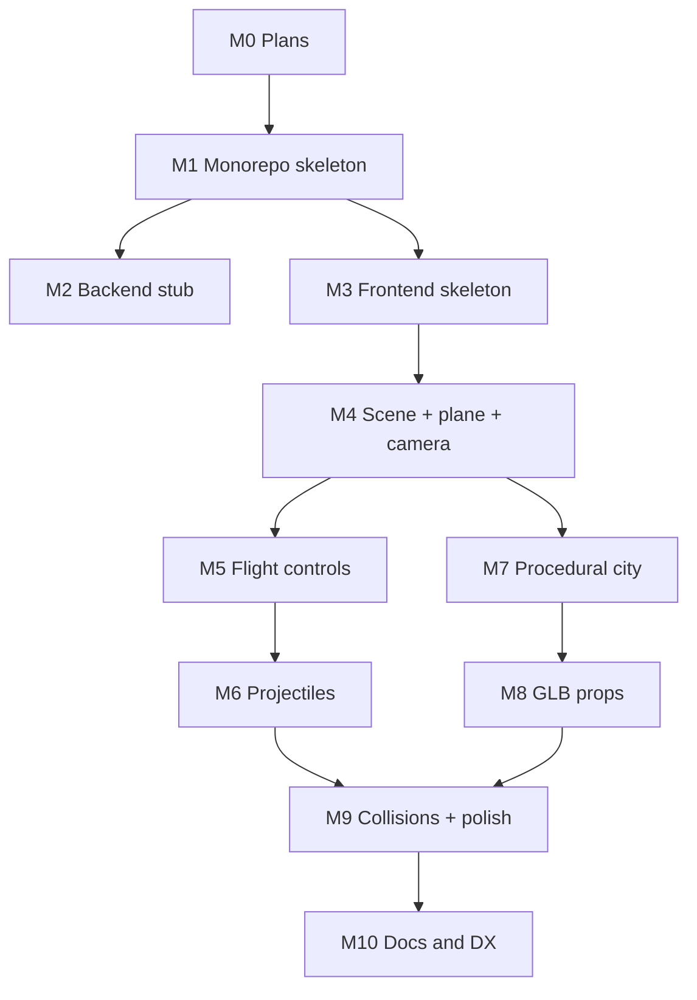

# 08 — Roadmap

A linear, dependency-ordered build plan. Each item is a milestone that produces something runnable. No time estimates — just order.

## Status legend

`[x]` done · `[~]` partial / works with placeholder · `[ ]` not started

## Milestone 0 — Plans (this document)

- [x] Capture decisions: stack, controls, map, monorepo shape.
- [x] Author the plan files in `plans/`.
- [x] Owner approved the plan.

## Milestone 1 — Monorepo skeleton ✅

- [x] Root `package.json` with bun workspaces (`backend`, `frontend`, `packages/*`).
- [x] Root `turbo.json` mirroring Garama.
- [x] Root `tsconfig.base.json`, `.prettierrc`, `.prettierignore`, `eslint.config.mjs`, `.gitignore`.
- [x] `packages/shared` package with `package.json`, `tsconfig.json`, and `src/index.ts` re-exporting `config.ts`, `types.ts`, `events.ts`.
- [x] `bun install` succeeds at the root (540 packages).
- [x] `turbo typecheck` passes across all 3 workspaces.

## Milestone 2 — Backend stub ✅

- [x] `backend/package.json` with hono + socket.io deps.
- [x] `backend/src/server.ts` exporting `createServer()` with `/health` only.
- [x] `backend/src/index.ts` boot file.
- [x] `bun run dev:backend` starts and `GET /health` returns `{ ok: true, service: 'flying-tung-tung-backend', uptimeSec: ... }` (verified live).

## Milestone 3 — Frontend skeleton ✅

- [x] `frontend/package.json` (Vite + TS + three + shared workspace dep).
- [x] `frontend/vite.config.ts`, `frontend/index.html`, `frontend/src/main.ts`.
- [x] Folder layout per [`02_FRONTEND_STRUCTURE.md`](02_FRONTEND_STRUCTURE.md).
- [x] Canvas + resize handler renders (verified via `vite build` in 2.23s).
- [x] `bun run dev` (root) starts both apps via Turborepo.

## Milestone 4 — Scene + plane + chase camera ✅

- [x] Sky (`three/examples/jsm/objects/Sky.js`) + sun (DirectionalLight) + ambient + hemi + fog matched to horizon.
- [x] Ground plane with procedural canvas-drawn road texture + outer green terrain.
- [x] GLB loader; load `tung-tung.glb`; normalize scale + derive nose offset.
- [x] Chase camera following the plane with smoothing.
- [x] HUD overlay HTML/CSS shell (crosshair, speed, turbo gauges, loading screen).

## Milestone 5 — Flight controls ✅

- [x] `input/mouse.ts` populates `state.input.cursorNdc` + `shootPressed` + `turbo`.
- [x] `planeController` system implements cursor-follow math with dead zone, rate damping, integration.
- [x] Roll / banking visual driven by yaw rate.
- [x] Right-click held → turbo (with FOV pump from 70 → 84).
- [x] World floor/ceiling clamp + soft horizontal bounds with auto-yaw-home.
- [x] Window-blur safety (zero inputs + release turbo).
- [x] Context menu suppressed so right-click works as turbo.

## Milestone 6 — Projectiles ✅

- [x] `entities/projectile.ts` with `InstancedMesh` of `POOL_SIZE = 256`.
- [x] Fire on left-click with `COOLDOWN_SEC` (edge-triggered).
- [x] Lifetime expiry + despawn (matrix scaled to 0).
- [x] Spawn from nose anchor with plane forward velocity * `PROJECTILE.SPEED`.
- [x] Cheap ground despawn (`y <= 0`).

## Milestone 7 — Procedural city ✅

- [x] Seeded RNG (`utils/rng.ts` Mulberry32) — deterministic from `CITY.SEED`.
- [x] City grid generator (40×40) emits cell descriptors (empty / park / building) + height + rotation.
- [x] Canvas-generated road/ground texture, tiled per cell.
- [x] Skybox via `three/examples/jsm/objects/Sky.js` with sun-direction sync.
- [x] Per-cell AABB lookup map for collision queries.

## Milestone 8 — GLB props integration ⚠️ partial

- [~] Source + commit Kenney City Kit + Nature Kit GLBs — **NOT YET**: drop GLBs into [`frontend/public/models/city/`](../frontend/public/models/city/) and [`frontend/public/models/nature/`](../frontend/public/models/nature/) as `building_a.glb`, `building_b.glb`, `building_c.glb`, `tree.glb`.
- [x] `propLibrary.preload()` loads all GLBs once with **automatic fallback to procedural cubes** when files are missing — the city renders today regardless.
- [x] City generator places props via `InstancedMesh` per prop type (one draw call per prop).
- [x] `CREDITS.md` under [`frontend/public/models/`](../frontend/public/models/CREDITS.md).

## Milestone 9 — Collisions + feel polish ⚠️ partial

- [x] Per-cell AABB lookup; projectile-vs-building hit test in `collisionSystem`.
- [ ] Cosmetic hit puff (TODO: tiny expanding sphere on impact).
- [x] HUD: speed readout + turbo indicator (DOM, throttled to 10 Hz).
- [ ] FPS counter (optional dev overlay).
- [ ] SFX hooks (pew on shoot, turbo whoosh).

## Milestone 10 — Docs & DX ✅

- [x] Top-level [`README.md`](../README.md) (run instructions, controls, credits, structure).
- [x] `turbo typecheck` passes across all packages.
- [x] `turbo build` succeeds (frontend Vite build OK).
- [ ] `turbo lint` not yet exercised end-to-end on the new code.
- [ ] Tag this state as "MVP" in git (owner action).

## Future (post-MVP, not in this plan's execution)

- Audio system + music.
- Pause menu / start screen.
- Touch / mobile controls.
- Multiplayer PvP (revives the backend).
- Destructible buildings.
- Power-ups (uses `angelic-tung-tung.glb`).
- Mini-map (Garama has a pattern we can borrow).

## Dependency graph (visual)

