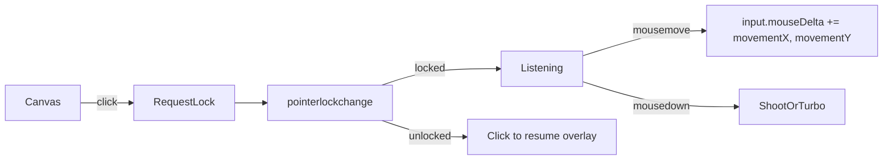
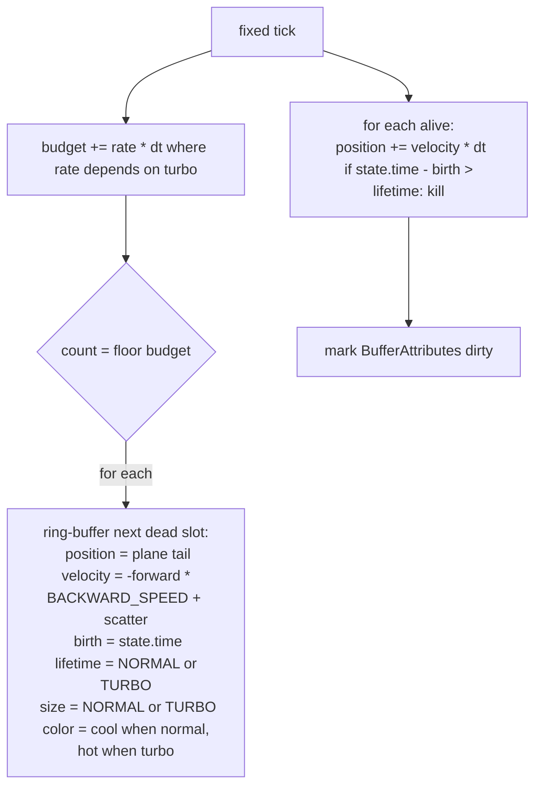

# 09 — Input rework + free flight + particle trail

Status: planned · supersedes the cursor/NDC steering described in [`03_PLANE_CONTROLS.md`](03_PLANE_CONTROLS.md).

## Goals

1. **Locked cursor** — the mouse no longer drifts across the screen; it is captured by Pointer Lock and the player effectively rotates the plane via mouse motion.
2. **Correct pitch sign** — FPS-style: moving the mouse forward (up on the screen) makes the nose pitch down; pulling back pitches up.
3. **Full 3-axis 360s** — no hard pitch clamp, no auto-yaw-home; loops, barrel rolls, and continuous yaws are all legal. Quaternion-based orientation removes gimbal limits.
4. **Particle trail** — a persistent jet/dust trail behind the character that intensifies (more particles, larger, brighter, longer-lived) when turbo is held.

## Architecture

### Input (Pointer Lock + deltas)

- `attachMouse(canvas, input)` — requests `canvas.requestPointerLock()` on click; manages `input.pointerLocked` via `pointerlockchange` / `pointerlockerror`.
- While locked: read `e.movementX/Y` only and accumulate into `input.mouseDelta`. Absolute position is irrelevant.
- The OS cursor is hidden by Pointer Lock; the existing centered HUD crosshair acts as the reticle.
- `input.mouseDelta` is consumed and zeroed at the top of every fixed tick by the controller.
- Esc releases the lock (browser default); click recaptures.

### Free-flight controller (quaternion-based)

Add `orientation: Vec4` (quaternion) to [`PlayerState`](../packages/shared/src/types.ts:17). `yaw/pitch/roll` stay on the type as derived/visual fields (HUD, banking) but the quaternion is authoritative for direction.

Per fixed tick:

1. Consume `input.mouseDelta`, then zero it.
2. `yawInput   = -mouseDelta.x * PLANE.YAW_SENSITIVITY`
   `pitchInput =  mouseDelta.y * PLANE.PITCH_SENSITIVITY` (FPS-style: positive `movementY` ⇒ positive nose-down rotation around local +X). Flip with a `PLANE.INVERT_PITCH` flag if we ever want a toggle.
3. Build small **local-frame** rotations and right-multiply into `state.player.orientation`:
   - pitch around local **X**
   - yaw around local **Y**
   The use of local axes (not world Y) is what allows free banking + 360s without snapping.
4. Smooth visual banking roll: target = `clamp(yawInput / dt, -1, 1) * MAX_ROLL`, exponentially damped with `TAU_ROLL` into `player.roll`. The roll is applied as an additional local-Z rotation only when **rendering** the plane (not stored back into `orientation`), so banking decays cleanly when the player stops yawing.
5. `forward = (0,0,1).applyQuaternion(orientation)`.
6. `position += forward * speed * dt`, where `speed = turbo ? CRUISE_SPEED * TURBO_MULT : CRUISE_SPEED`.
7. Soft world bounds: clamp `position.y` between `WORLD_FLOOR_Y` and `WORLD_CEIL_Y`; clamp horizontal position to ±`WORLD_HALF_SIZE`. **No yaw forcing** — the player keeps full control.

Removed:
- The `MAX_PITCH` clamp at [`planeController.ts:31`](../frontend/src/game/systems/planeController.ts:31).
- The `atan2` auto-home block at [`planeController.ts:63-72`](../frontend/src/game/systems/planeController.ts:63).
- All `cursorNdc` / NDC math.

### Particle trail

- New entity [`frontend/src/entities/particleTrail.ts`](../frontend/src/entities/particleTrail.ts:1):
  - `BufferGeometry` with attributes: `position` (vec3), `aBirth` (float), `aLifetime` (float), `aSize` (float), `aColor` (vec3).
  - Pool size = `PARTICLES.POOL_SIZE`.
  - `ShaderMaterial`: additive blending, `depthWrite: false`, vertex shader fades alpha and shrinks size with `t = (now - aBirth) / aLifetime`, fragment shader is a soft radial disc.
- New system [`frontend/src/game/systems/particleSystem.ts`](../frontend/src/game/systems/particleSystem.ts:1):
  - Tracks an emission budget on `GameState` (`particleBudget: number`).
  - Each tick: `rate = turbo ? EMIT_RATE_TURBO : EMIT_RATE_NORMAL`; `budget += rate * dt`; emit `floor(budget)` and decrement.
  - Spawn anchor: `planeTail(plane, player)` = player position − forward × (model length × 0.5); add small perpendicular jitter.
  - Velocity: backward = forward × −`BACKWARD_SPEED`, plus uniform-sphere scatter scaled by `SCATTER_SPEED`.
  - Particle styling: cool colors (cyan/white) when not boosting; hot colors (orange/red) when turbo, with `SIZE_TURBO` and `LIFETIME_TURBO` applied at spawn so the trail visibly thickens and lingers.
  - Sets `needsUpdate` only on dirty attributes that were touched this tick.

### HUD / UX

- New `#pointer-hint` overlay in [`frontend/index.html`](../frontend/index.html:1) with copy "Click to play". Shown when `!input.pointerLocked`, hidden otherwise.
- Update top-left hint to: "Move mouse to steer · Click to shoot · Right-click turbo · Esc to release mouse".
- [`hud.css`](../frontend/src/ui/hud.css:22) loses `cursor: crosshair` on the canvas (Pointer Lock hides the cursor anyway, and we don't want a visible OS cursor flickering during the brief unlocked window).

## Touched files

| File | Change |
|---|---|
| [`packages/shared/src/types.ts`](../packages/shared/src/types.ts:17) | Add `Vec4`; add `orientation: Vec4` to `PlayerState` |
| [`packages/shared/src/config.ts`](../packages/shared/src/config.ts:7) | Add `PLANE.INVERT_PITCH = false` |
| [`frontend/src/input/mouse.ts`](../frontend/src/input/mouse.ts:1) | Rewrite — Pointer Lock + mouse deltas, takes `canvas` |
| [`frontend/src/game/gameState.ts`](../frontend/src/game/gameState.ts:1) | Init `orientation`, `mouseDelta`, `pointerLocked`, `particleBudget`; drop `cursorNdc` |
| [`frontend/src/game/systems/planeController.ts`](../frontend/src/game/systems/planeController.ts:1) | Delta-driven, quaternion-based; remove pitch clamp + auto-home |
| [`frontend/src/entities/plane.ts`](../frontend/src/entities/plane.ts:1) | `applyPose`/`planeForward`/`planeNose` via quaternion; new `planeTail` |
| [`frontend/src/entities/particleTrail.ts`](../frontend/src/entities/particleTrail.ts:1) | **new** |
| [`frontend/src/game/systems/particleSystem.ts`](../frontend/src/game/systems/particleSystem.ts:1) | **new** |
| [`frontend/src/main.ts`](../frontend/src/main.ts:1) | Wire canvas into `attachMouse`; create + update particle trail |
| [`frontend/src/game/systems/hudSystem.ts`](../frontend/src/game/systems/hudSystem.ts:27) | Toggle `#pointer-hint` from `state.input.pointerLocked` |
| [`frontend/index.html`](../frontend/index.html:1) | Add `#pointer-hint`; refresh hint copy |
| [`frontend/src/ui/hud.css`](../frontend/src/ui/hud.css:22) | Style `#pointer-hint`; remove `cursor: crosshair` |

## Acceptance criteria

- After clicking the canvas, the OS cursor disappears and stays captured. Esc releases it; clicking recaptures.
- Mouse motion rotates the plane; absolute cursor position has no effect.
- Mouse forward (up) ⇒ nose **down**; mouse back (down) ⇒ nose **up**. Mouse left/right yaws accordingly.
- The plane can complete a full vertical loop, a full barrel roll, and continuous left/right 360s without ever being "blocked" or auto-corrected.
- A continuous particle trail follows the character. With right-click held, particles become noticeably more numerous, larger, and warmer-colored.
- Type-check passes; no references to `cursorNdc`, `MAX_PITCH`, `MAX_YAW_RATE`, `MAX_PITCH_RATE`, `DEAD_ZONE`, `TAU_YAW`, or `TAU_PITCH` remain.
