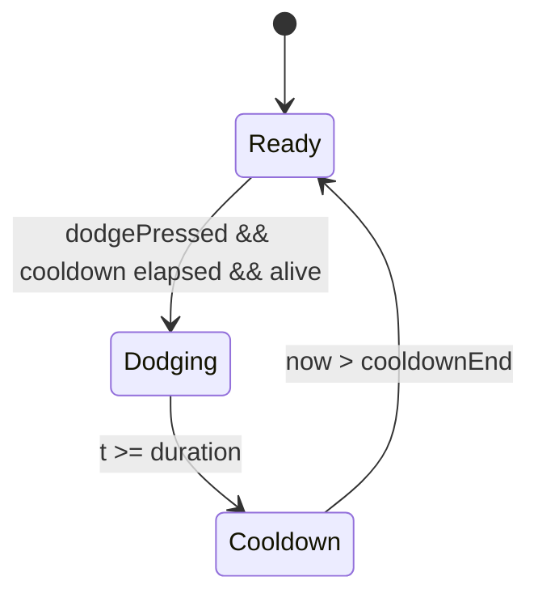
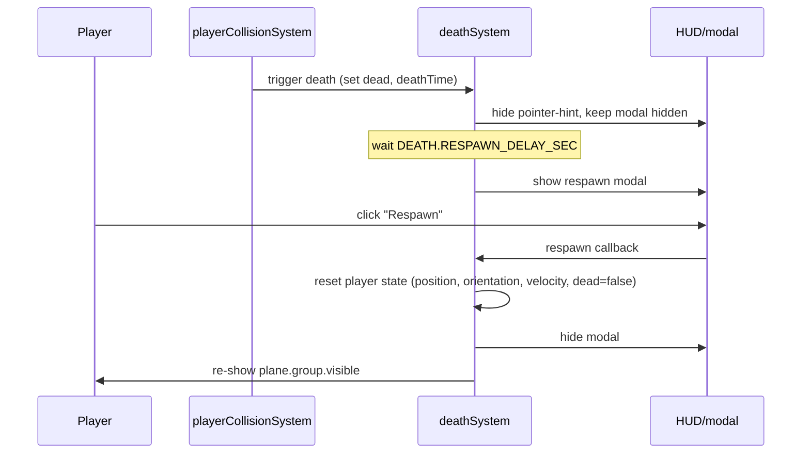

# 10 — Side-barrel dodge, player death + respawn, bigger city

Status: implemented · supersedes the click-to-shoot mapping in [`09_INPUT_AND_PARTICLES.md`](09_INPUT_AND_PARTICLES.md) and the city scale rules in [`05_CITY_MAP.md`](05_CITY_MAP.md).

## Goals

1. **New control scheme**
   - **Left mouse held** → turbo
   - **Right mouse click** → one-shot **side barrel dodge** (animated 360° roll + lateral translation)
   - **K key** → shoot
2. **Player ↔ building collision** kills the plane with a big explosion burst, freezes the world for 2 seconds, then shows a "Respawn" modal.
3. **City bigger and skyline more dramatic** — most buildings small/medium, a notable few rare super-tall landmarks.

## Control mapping rationale

`PlayerInput` keeps its existing fields and gains one new edge trigger:

| Field | Source | Notes |
|---|---|---|
| `mouseDelta` | pointer-lock movementX/Y | unchanged |
| `turbo` | left mouse held | flipped from right mouse |
| `shootPressed` | "K" keydown (edge) | flipped from left click |
| `dodgePressed` | right mouse down (edge) | **new** |
| `pointerLocked` | pointer-lock state | unchanged |

The edge triggers (`shootPressed`, `dodgePressed`) are consumed once per fixed tick by their respective systems.

## Side-barrel dodge



Stored on `GameState`:

```ts
dodge: {
  active: boolean;
  startTime: number;     // sim time when the dodge began
  dir: -1 | 1;           // chosen at trigger
  duration: number;      // PLANE.DODGE_DURATION
  cooldownUntil: number; // earliest sim time we can re-trigger
};
```

### Direction choice

Pointer Lock means the OS cursor sits at canvas center, so "which side is the mouse on" is interpreted as **recent yaw intent**. We track:

```ts
state.yawIntent = damp(state.yawIntent, mouseDelta.x, PLANE.YAW_INTENT_TAU, dt);
```

On the trigger frame:

```ts
dir = state.yawIntent >= 0 ? +1 : -1;     // default to right if motionless
```

This feels intuitive: if the player is currently steering right, the dodge goes right; if they're steering left, it goes left.

### Animation + translation

While `dodge.active`:
- `t = (now - startTime) / duration ∈ [0, 1]`
- **Visual roll**: `state.player.dodgeRoll = t * 2π * dir` — one full revolution over the duration. Composed *additively* on top of banking inside [`applyPose()`](../frontend/src/entities/plane.ts:64). Reset to `0` when the dodge ends so the plane comes out level.
- **Lateral translation**: along the plane's local **right** axis (orientation × (1,0,0)):
  ```ts
  lateralSpeed = sin(t * π) * PLANE.DODGE_LATERAL_SPEED * dir;  // peaks mid-dodge
  player.position += right * lateralSpeed * dt;
  ```
- **Forward speed**: unchanged — the plane keeps cruising while it dodges.

### Cooldown

`cooldownUntil = endTime + PLANE.DODGE_COOLDOWN` so the dodge can't be spammed.

## Player ↔ building collision (5 lives + immunity)

New system [`frontend/src/game/systems/playerCollisionSystem.ts`](../frontend/src/game/systems/playerCollisionSystem.ts:1).

- The player has `PLAYER.MAX_LIVES = 5` lives. Each fatal-looking AABB intersection costs a life.
- After every hit (even non-fatal) the player is granted `PLAYER.IMMUNITY_SEC = 1.0` second of post-hit invulnerability so they aren't immediately re-killed while still clipping the same geometry. The plane mesh flickers at 14 Hz during this window for visual feedback (handled in [`main.ts`](../frontend/src/main.ts:1)).
- The same immunity is granted at startup and on respawn so the spawn frame is always safe.
- Test scope: the player's grid cell + the eight neighbours, sphere-AABB squared-distance.
- On a non-fatal hit (`lives > 0`): spawn a small `BurstKind.Building` burst, decrement lives, set `immunityUntil`.
- On a fatal hit (`lives` would drop to 0): also spawn the big `BurstKind.PlayerDeath` burst, set `state.player.dead = true`, store `state.deathTime`. The plane controller short-circuits while dead so the world is frozen around the wreckage cloud while the camera lingers.

### Spawn-safety plaza

The bigger city ([`05_CITY_MAP.md`](05_CITY_MAP.md)) made the spawn point a coin-flip into a building. We now force a Chebyshev-radius `CITY.SPAWN_SAFE_RADIUS_CELLS = 4` (9 × 9 cells, ≈ 342 unit-wide) plaza of `kind: 'empty'` cells around the central spawn cell. Combined with the post-respawn immunity this guarantees the first second after spawning is collision-free.

### Lives HUD

The bottom-left HUD now shows a `LIVES` bar with five circle segments. Each lost life darkens to an outline. [`hudSystem.ts`](../frontend/src/game/systems/hudSystem.ts:1) only re-renders when `state.player.lives` actually changes.

## Death + respawn flow



New system [`frontend/src/game/systems/deathSystem.ts`](../frontend/src/game/systems/deathSystem.ts:1) owns:
- **Pointer-lock release on death** — the moment `player.dead` flips to `true`, the system calls `document.exitPointerLock()` and sets `state.input.allowLock = false`. The OS cursor returns immediately so the modal becomes clickable. [`mouse.ts`](../frontend/src/input/mouse.ts:1) skips its `requestPointerLock()` call while `allowLock` is `false`, preventing accidental relocks during the 2 s pre-modal window.
- `update(state, plane, canvas)` — toggles modal visibility based on `state.player.dead && (now - deathTime) ≥ DEATH.RESPAWN_DELAY_SEC`; re-shows the plane mesh after respawn.
- **Respawn click ↔ pointer lock** — the button click handler runs in a real user-gesture context, so it both signals `respawnRequested` for the next tick and immediately calls `canvas.requestPointerLock()`. The player goes straight back into play with no extra click.

Modal markup lives in [`frontend/index.html`](../frontend/index.html:1) (`#respawn-modal` with a button `#respawn-btn`). Styling in [`hud.css`](../frontend/src/ui/hud.css:1) reuses the same dark-glass aesthetic as the pointer-hint overlay.

## Bigger, more dramatic city

In [`packages/shared/src/config.ts`](../packages/shared/src/config.ts:1):
- `CITY.GRID_SIZE` 40 → **56**
- `CITY.CELL_SIZE` 30 → **38** (so the city covers ≈2128² instead of 1200², ≈3.1× footprint)
- `CITY.HEIGHT_MAX` 140 → **180** for the standard band
- `CITY.SKYSCRAPER_CHANCE` 0.08 → **0.06**, but the multiplier is tuned alongside the new super-tall path
- New `CITY.SUPERTALL_CHANCE = 0.012` (≈1.2 % of cells) → height becomes `CITY.SUPERTALL_BASE + rng() * CITY.SUPERTALL_RANGE` ⇒ **≈260–520** units. These are landmarks, not common.
- `CITY.EMPTY_CHANCE` 0.08 → **0.06** — denser

In [`frontend/src/world/city.ts`](../frontend/src/world/city.ts:76):

```ts
let height = 0;
if (kind === 'building') {
  if (rng() < CITY.SUPERTALL_CHANCE) {
    height = CITY.SUPERTALL_BASE + rng() * CITY.SUPERTALL_RANGE;
  } else {
    const baseRoll = Math.pow(rng(), CITY.HEIGHT_GAMMA);
    height = CITY.HEIGHT_MIN + baseRoll * (CITY.HEIGHT_MAX - CITY.HEIGHT_MIN);
    if (rng() < CITY.SKYSCRAPER_CHANCE) height *= CITY.SKYSCRAPER_MULT;
  }
}
```

`PLANE.WORLD_HALF_SIZE` is bumped to **2200** so the new city has clearance margin.

## File-touch summary

| File | Why |
|---|---|
| [`packages/shared/src/types.ts`](../packages/shared/src/types.ts:1) | `PlayerState.dead`, `PlayerState.dodgeRoll`, `PlayerInput.dodgePressed` |
| [`packages/shared/src/config.ts`](../packages/shared/src/config.ts:1) | Control-mapping comments; `PLANE.DODGE_*`, `PLANE.YAW_INTENT_TAU`, `PLANE.COLLIDER_RADIUS`; `DEATH.RESPAWN_DELAY_SEC`; new `CITY.SUPERTALL_*`; bigger grid; `WORLD_HALF_SIZE` bumped; `PARTICLES.BURST_PLAYER_*` for the death explosion |
| [`frontend/src/input/mouse.ts`](../frontend/src/input/mouse.ts:1) | Remap left/right; "K" keyboard shoot; new `dodgePressed` edge |
| [`frontend/src/game/gameState.ts`](../frontend/src/game/gameState.ts:1) | Initialize `dodge`, `yawIntent`, `deathTime`, `dead`, `dodgeRoll` |
| [`frontend/src/game/systems/planeController.ts`](../frontend/src/game/systems/planeController.ts:1) | Dodge state machine; `yawIntent` smoothing; freeze when dead |
| [`frontend/src/entities/plane.ts`](../frontend/src/entities/plane.ts:1) | `applyPose` adds `dodgeRoll` to the visual roll |
| [`frontend/src/game/systems/playerCollisionSystem.ts`](../frontend/src/game/systems/playerCollisionSystem.ts:1) | **new** sphere-vs-AABB; triggers death + explosion burst |
| [`frontend/src/game/systems/deathSystem.ts`](../frontend/src/game/systems/deathSystem.ts:1) | **new** death timer + modal toggle + respawn |
| [`frontend/src/game/systems/particleSystem.ts`](../frontend/src/game/systems/particleSystem.ts:1) | New `BurstKind.PlayerDeath` with bigger count/speed/size |
| [`frontend/src/world/city.ts`](../frontend/src/world/city.ts:1) | Super-tall path in the height roll |
| [`frontend/src/main.ts`](../frontend/src/main.ts:1) | Wire `playerCollisionSystem` + `deathSystem`; hide plane while dead |
| [`frontend/index.html`](../frontend/index.html:1) | `#respawn-modal` markup; updated hint copy |
| [`frontend/src/ui/hud.css`](../frontend/src/ui/hud.css:1) | `#respawn-modal` styling |
| [`frontend/src/game/systems/hudSystem.ts`](../frontend/src/game/systems/hudSystem.ts:1) | Modal show/hide hook + button click |

## Acceptance criteria

- Holding left mouse boosts the plane (turbo). Right mouse clicks trigger a dodge.
- Pressing **K** fires a projectile.
- Hitting right mouse rolls the plane through a full 360° in ~0.7 s while sliding the plane sideways; direction matches the most-recent steering bias.
- Crashing into a building produces a big red-orange explosion, hides the plane, freezes the world, and after 2 s a centered "Respawn" modal appears with a button. Clicking it resets the plane and resumes play.
- The city covers a much larger area, with most buildings short or medium and a sparse handful of dramatic super-tall towers.
- `turbo typecheck` passes; no references to the obsolete control bindings remain.
